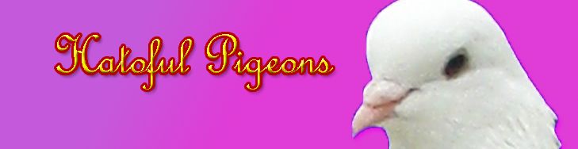

#Hatoful Pigeons
######Unity Projects - CG Fall 2015 @ Rutgers
######By: *Erin Corrado, Nikhil Kumar, Daniel Bordak*
Check out our website: [Kumar Code](http://kumarcode.com/Unity-Navigation-and-Animation/ "Unity Navigation and Animation")

Image Credit: PigeoNation Inc.

###B1: Navigation and Animation
Link to Blog: http://kumarcode.com/Unity-Navigation-and-Animation/

Part 1:

Instructions:
Agents:
Use the left mouse button to click on the agent capsules and select them (they will turn yellow). 
Right click to move the selected agents to a point within the arena.

Obstacles:
Left click to select the red cylinder obstacles. Left click again to deselect them.
Tap the arrow keys to move the obstacles around the arena.

Roaming Devils:
The dark cubes will move back and forth and the agents will avoid them. They cannot be controlled by the user.

Questions:
Carving and Not Carving NavMesh Obstacles:
Carving means that the NavMash obstacle creates a hole in the navigation mesh so that agents can plan paths around it.
Non carving means that an agent will not plan a path around the obstacle but will move around the obstacle while being blocked and trying to find a path. 
A NavMesh Obstacle should be carving when it is stationary.
A NavMesh Obstacle should be non carving when it is moving.
The reason for this is that carving takes a lot of computation. When an obstacle is moving, it needs to continuously recalculate its NavMesh hole as it moves which takes more processing power. Typically, an obstacle only carves when it is standing still and does not carve when it moves to save processing time.

When the Carve option is left unchecked in Unity, the NavMesh Obstacle defaults to Obstructing mode. Obstructing mode is a type of local avoidance where the agents will try to avoid collisions with obstacles and will collide with the obstacle if they get too close. This mode is good for cases where the object is constantly moving, so the agent doesn't have to continually recalculate a path around the obstacle.

Roaming Devils:
The roaming devils are constantly moving, so having them constantly carve the NavMesh would take a lot of processing power and require the agents to continually recompute their paths which would lead to awkward movements.

Part 2:
Instructions:
Control the character using the Arrow or WASD keys.
Hold down LEFT SHIFT to run.
Press SPACE to jump.

Part 3:
Instructions:
Left click to select. Right click to walk.
Hold down left shift and right click to run.
The characters will automatically jump when navigating to a higher level plane.
The characters' speeds can be set using the public variable.
The Obstacles and Roaming Devils follow the same rules and controls as in Part 1.

Extra Credit:
We implemented Roaming Devils which are the black brown cubes that move around while the agents avoid them. As previously stated, we did not carve the mesh due to computation time and awkward crowd movements.

###B2: Inverse Kinematics
1. I am a hard project!
2. Features
3. Description

###B3: Behavior Trees
1. I am a cool project!
2. Features
3. Description

###B4: Interactive Narrative Game
1. I am a real project!
2. Features
3. Description
